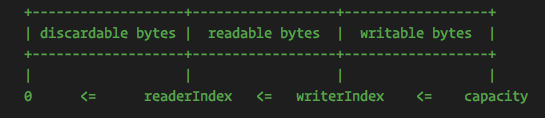

Java的NIO模块提供了ByteBuffer作为其字节存储容器，但是这个类的使用过于复杂，因此Netty实现了ByteBuf来替换NIO的ByteBuffer类，ByteBuf具有以下的特点:
1. 自定义用户缓冲区域的类型
2. 实现字节区域的深浅拷贝
3. 容量可按需增长
4. 在读写模式直接不需要像JDK的ByteBuffer那样调用flip()方法切换
5. 读写使用不同的索引，即readIndex和writeIndex
6. 支持方法链式调用
7. 支持引用计数和池化操作

下面我们将深入学习Netty的核心之一的ByteBuf的内部。

## 1. 读索引和写索引
ByteByf内部有三个主要的标记分别是readInde、writeIndex以及capacity，分别用来标记度索引,写索引，以及容器容量.其基本数据结果如下图所示：



当构建一个新的非Wrap和Copy类型的ByteBuf的时候`readIndex = writeIndex = 0`
在后面的读取操作，主要分为两类： 相对操作和绝对操作

1. 相对操作: 在读写操作的时候移动readIndex或者writeIndex，主要是read*() 或者skip*()或者write*()操作方法，这些操作在使用的时候会移动这两个索引。

2. 绝对操作： 绝对操作主要是是通过索引随机读取(这里的索引并非readIndex和writeIndex,值得是字节的索引位置)，通过这种操作并不会移动readIndex或者writeIndex，比如getByte(int index)、setByte(int index,int value)等；

如果readIndex > write 或者 write > capacity 的时候将会抛出IndexOutOfBoundException


## 2. 缓存区类型

ByteBuf实现的类型主要有三种：
1. 堆缓冲区
2. 直接缓冲区(非堆缓冲)
3. 复合缓冲区

堆内存缓冲区由JVM进行管理，因此创建和释放非常的方便，但是在进行数据交互的时候，需要从JVM内存中拷贝到操作系统直接内存中，性能略低。同样的对于直接缓冲器而言，其读写数据非常方便，不需要再次拷贝数据，但是JVM对其管理(创建和释放)相对于JVM堆内存而言，都不是太容易。

所以综合而言，针对后端的数据处理业务，则推荐使用HeapByteBuf，对IO线程交互等操作，推荐使用DirectByteBuf.

### 2.1 堆缓冲区
堆缓冲区是ByteBuf最常见的实现模式，其实将数据存储在JVM的堆内存中，内部实现是array数据，所以这种模式也成为`数组支撑`，可以通过`hasArray()` 方法判断其内部实现是否是数组支撑，如果是的话，我们可以安全的使用`arrayOffset()`方法来获取偏移量结合readableBytes()来获取其底层实现，即获取byte[],比如:

```java
    Charset charset = Charset.forName("utf-8");
    ByteBuf stringByteBuf = Unpooled.copiedBuffer("hello world", charset);
    if (stringByteBuf.hasArray()) {
      byte[] array = stringByteBuf.array();
      // as this, arrayOffset === 0
      int startIndex = stringByteBuf.arrayOffset() + stringByteBuf.readerIndex();
      // return value = writeIndex - readIndex
      int length = stringByteBuf.readableBytes();
      byte[] newBytes = Arrays.copyOfRange(array, startIndex, length);
      System.out.println("数组支撑转换:" + new String(newBytes,charset));
    }
```
> 如果不是数组支撑实现的话，调用`arrayOffset()`方法将会抛出UnsupportOperationException.


### 2.2 直接缓冲区
直接缓冲区是ByteBuf的另外一种实现的模式，但是其内存分配是操作系统实现的，且内存并非在堆内存上。JavaDoc的
文档指出

> 直接缓冲区的内容将会驻留在常规的会被垃圾回收的堆内存之外

这也就说明了为什么直接缓冲区是对于网络数据传输的最理想的方式,但是直接缓冲区相对于堆缓冲区来说，其分配和释放都比较昂贵，如果需要进行直接缓冲区的数据字节操作，你首先需要的是进入数据的复制操作，下面的代码是基于直接缓冲区的读操作：

```java
    Charset charset = Charset.forName("utf-8");
    ByteBuf stringByteBuf = Unpooled.copiedBuffer("hello world", charset);
    
    if(!stringByteBuf.hasArray()){
      int lenght = stringByteBuf.readableBytes();
      byte[] bytes = new byte[lenght];
      stringByteBuf.getBytes(stringByteBuf.readerIndex(),bytes);
      System.out.println(new String(bytes,charset));
    }
```

### 2.3 复合缓冲区
复合缓冲区比较复杂，其主要是CompositeByteBuf实现，后面专门开一个文件学习这个实现模式.

## 3 字节读写操作
ByteBuf是一个抽象类，不能使用new关键字创建，我们可以使用Unpooled创建，如下:

```java
    // 创建ByteBuf ，capacity设置为10
    ByteBuf byteBuf = Unpooled.buffer(10);
```

### 3.1 写操作
ByteBuf提供了多个writeByte() 重载操作，我们可以使用这个进行写数据。使用writeByte()方法写入数据会自动移动writeInde，如下:

```java
    ByteBuf buffer = Unpooled.buffer(10);
    System.out.println("写数据之前ByteBuf的writeIndex=" + buffer.writerIndex());
    for (int i = 0; i < buffer.capacity(); i++) {
      buffer.writeByte(i);
    }
    System.out.println("写数据之后ByteBuf的writeIndex=" + buffer.writerIndex());
```

同时ByteBuf也提供了set(int index,int value)按索引写入的方法，给定索引和数据，按索引写入，如下:

```java
    ByteBuf buffer = Unpooled.buffer(10);
    System.out.println("写数据之前ByteBuf的writeIndex=" + buffer.writerIndex());
    for (int i = 0; i < buffer.capacity(); i++) {
      buffer.setByte(i,i);
    }
    System.out.println("写数据之后ByteBuf的writeIndex=" + buffer.writerIndex());
```

> 写操作的时候，如果writeIndex > capaction  则会按指数扩容

### 3.2 读操作

同样的，读操作也有两种方式: 一种是按顺序读取，另外一种是指定索引读取. 按顺序则通过`readByte()` 读取，readByte读取每次读取一个字节，同时readIndex会自动移动，按指定索引读取，则不会移动readIndex.

#### 3.2.1 按顺序读取 
ByteBuf可以通过readByte()方法读取，如果可读字节耗尽，那么将会抛出IndexOutOfBoundException异常，所以在每次readByte()的时候需要判断是否可读，示例代码如下：

```java
    ByteBuf buffer = Unpooled.buffer(10);
    // 写数据
    for (int i = 0; i < buffer.capacity(); i++) {
      buffer.setByte(i,i);
    }
    // 循环遍历，有数据继续读取
    while (byteBuf.isReadable()) {
      System.out.print(byteBuf.readByte());
    }
```

#### 3.2.2 按索引读取

使用getByte(int index)可以获取数据，但是readIndex不会移动,但是要求readIndex小于writeIndex.

```java
    ByteBuf buffer = Unpooled.buffer(10);
    for (int i = 0; i < buffer.capacity(); i++) {
      buffer.setByte(i,i);
    }
    for (int i = 0; i < buffer.capacity(); i++) {
      System.out.print(buffer.getByte(i));
    }
```

### 3.3 搜索操作
ByteBuf最简单的搜索方法就是`indexOf()` 方法，indexOf() 不存在的时候返回的索引为 -1 .

```java
    ByteBuf buffer = Unpooled.buffer(6);
    for (int i = 0; i < buffer.capacity(); i++) {
      buffer.setByte(i,i);
    }
    int index = buffer.indexOf(0,buffer.capacity(),Byte.valueOf("5"));
    System.out.println("查找到索引位置 = " + index);
    index = buffer.indexOf(0,buffer.capacity(),Byte.valueOf("9"));
    System.out.println("查找到索引位置 = " + index);
```


### 3.4 索引管理
ByteBuf 提供了mark()和reset()方法来标记和重置readIndex和writeIndex这两个索引,分别是:

+ markReadIndex() 
+ markWriteIndex()
+ resetReadIndex()
+ resetWriteIndex()

若要重置readIndex和writeIndex，可以使用clean()方法，clean() 方法的实现为`readIndex = writeIndex = 0`,但是不会清除内容,测试代码如下：

```java
    // 申请空间
    ByteBuf byteBuf = Unpooled.buffer(10);
    // 写入7个数据
    for (int i = 0; i < 7; i++) {
      byteBuf.writeByte(i);
    }

    // 输出数据
    while (byteBuf.isReadable()) {
      System.out.print(byteBuf.readByte());
      System.out.print(",");
    }
    System.out.println();
    // 打印当前索引位置
    int writeIndex = byteBuf.writerIndex();
    // 重置索引
    byteBuf.clear();

    // 写入两个数据
    byteBuf.writeByte(10).writeByte(10);
    // 将writeIndex索引设置到{writeIndex}
    byteBuf.writerIndex(writeIndex);
    // 输出数据,可见0和1被覆盖了，其他的还是原来的数据
    while (byteBuf.isReadable()) {
      System.out.print(byteBuf.readByte());
      System.out.print(",");
    }
```

### 3.5 复制操作

某些场景下，我们需要复制某个ByetBuf，ByteBuf提供了两种复制机制：浅拷贝和深拷贝.

1. 浅拷贝 一般使用duplicate()方法，该方法返回一个新的ByteBuf实例, 它具有自己的读索引和写索引和标记索引。但其存储和源对象共享内容,所以修改拷贝实例，原实例也会修改,需要注意。

2. 若要创建新的完全真实的副本实例，可使用copy() 方法或copy(int,int)创建完全独立的副本。
